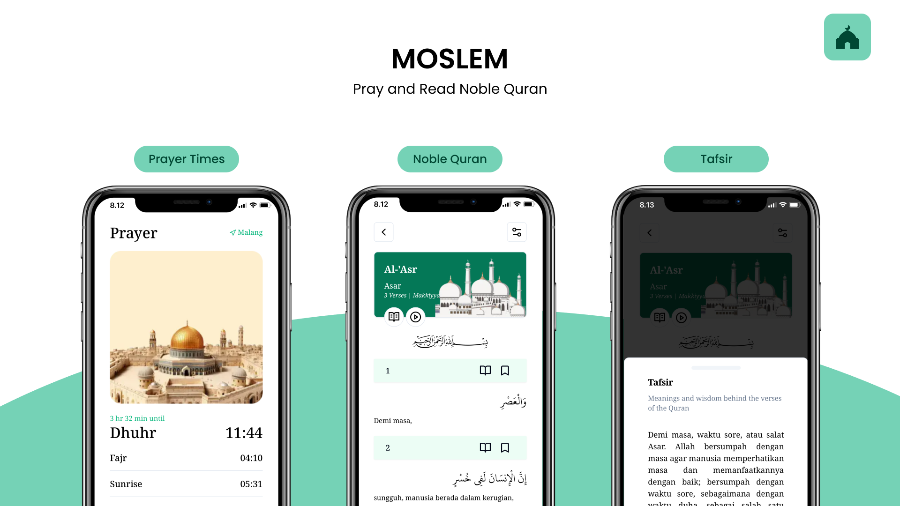

# ✦ Moslem

**Pray & Read Noble Quran — pendamping ibadah harianmu, di mana saja.**

Jadwal sholat akurat, Al-Qur'an digital dengan tafsir, kompas kiblat, dan pengingat adzan —
semuanya dalam satu aplikasi ringan yang bisa terpasang di HP-mu.

---

## ✨ Kenapa Moslem?

Moslem dibuat dengan satu tujuan: **memudahkan ibadah, bukan menambah kerumitan.**
Tanpa akun, tanpa iklan, tanpa fitur yang tidak perlu. Buka aplikasinya — jadwal sholat,
Al-Qur'an, dan arah kiblat langsung ada di ujung jarimu.

## 🕌 Fitur Unggulan

### ⏰ Jadwal Sholat Otomatis
- **Deteksi lokasi otomatis** — sekali izinkan akses lokasi, jadwal langsung disesuaikan kota-mu. Pindah kota? Jadwal ikut menyesuaikan.
- **Hitung mundur menuju adzan berikutnya** sehingga kamu tak pernah ketinggalan waktu.
- Tandai sholat yang akan datang, lengkap dengan tanggal Masehi dan Hijriah.

### 🌅 Ilustrasi yang Mengikuti Waktu
Ilustrasi masjid pada aplikasi **berubah suasana** mengikuti waktu sholat — gelap saat subuh,
terang siang hari, keemasan saat senja, dan kembali gelap menuju malam. Seperti melihat langit
di luar jendela.

### 📖 Al-Qur'an Lengkap
- **114 surah** dengan teks Arab standar Utsmani, terjemahan, dan transliterasi.
- **Tafsir per ayat** — cukup ketuk, penjelasannya muncul.
- **Mode Mushaf** — matikan terjemahan dan baca Al-Qur'an persis seperti mushaf cetak:
  teks menyambung mengalir dari kanan ke kiri dengan penanda ayat emas.
- **Lanjutkan membaca** — aplikasi mengingat ayat terakhir yang kamu baca dan mengembalikanmu ke sana.
- **Murottal per surah** (Sheikh Mishary Alafasy) untuk mendengarkan sambil membaca.
- Font Arab & ukuran teks bisa diatur sesuai kenyamanan matamu.

### 🧭 Kompas Kiblat Presisi
- Menggunakan **sensor magnetometer penuh** (Absolute Orientation Sensor) ponselmu.
- Jarum emas menunjuk arah kiblat, lengkap dengan jarak ke Ka'bah.
- Notifikasi "✓ Anda menghadap kiblat" saat arahmu tepat.

### 🔔 Notifikasi Adzan
- Terima pemberitahuan **saat masuk waktu sholat** — bahkan saat aplikasinya tertutup.
- Menggunakan notifikasi standar HP-mu, sederhana dan tidak mengganggu.

### 📲 Instal Seperti Aplikasi Biasa
Moslem adalah **PWA (Progressive Web App)** — buka di browser, pilih *Add to Home Screen*,
dan langsung terpasang seperti aplikasi native. Ringan, cepat, dan hemat storage.

### 🌙 Mode Gelap & Terang
Mengikuti tema HP-mu secara otomatis, atau atur manual dengan satu ketukan.

---

## 🚀 Mulai dalam 30 Detik

1. Buka **Moslem** di browser HP-mu.
2. Izinkan akses **lokasi** — jadwal sholat langsung akurat.
3. Ketuk ikon **⋮ / Share** lalu pilih **Add to Home Screen** / **Install**.
4. Ketuk di mana saja pada layar untuk mengaktifkan **notifikasi adzan**.

Selesai. Moslem siap menemanimu sholat tepat waktu dan membaca Al-Qur'an setiap hari.

---

## 🕋 Privasi

Moslem tidak meminta akun, tidak melacak, dan tidak menyimpan data pribadimu.
Lokasi hanya dipakai untuk menghitung jadwal sholat dan arah kiblat — di perangkatmu sendiri.

---

**✦ Moslem** — *Pray on time. Read the Quran. Find your qibla.*

Dibuat dengan ketulusan untuk umat. 🤍

